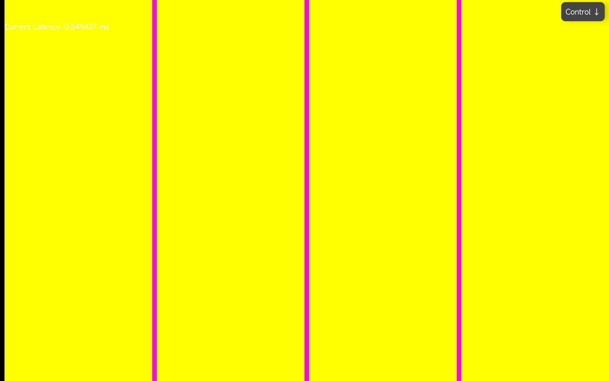

## Brokenithm-Slide-Android

A fork of [Brokenithm-Android](https://github.com/tindy2013/Brokenithm-Android) that removes the air sensor input, leaving only the touch slider.

Air sensor input has been removed. This app is intended to be used alongside [Brokenithm-Hands-Android](https://github.com/SinaKh0/Brokenithm-Hands-Android) handling air input, with two instances of the [modified server](https://github.com/SinaKh0/Brokenithm-Android-Server) using the `-s` (slider only) and `-a` (air only) flags to split input across two devices.

Supports UDP and TCP connection to host. TCP recommended for lower latency.

<p align="center">
  
</p>

## Dual Device Setup

To use both apps together, run two server instances on Windows:
```bash
brokenithm.exe -T -s -p 52468  # slider instance
brokenithm.exe -T -a -p 52469  # air instance
```

Connect this app to port 52468 and Brokenithm-Hands-Android on the other android device to port 52469.

## Low Latency Setup (USB)

For the lowest latency, connect your devices via USB and use ADB reverse port forwarding instead of WiFi. With both devices plugged in run:
```bash
adb devices  # to get serial of both devices
adb -s <slider_device_serial> reverse tcp:52468 tcp:52468
adb -s <hands_device_serial> reverse tcp:52469 tcp:52469
```

Then in each app use `127.0.0.1:PORT` as the server address and enable TCP mode.